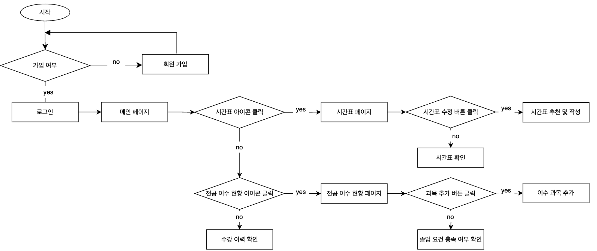
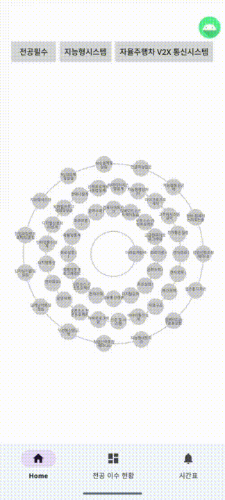
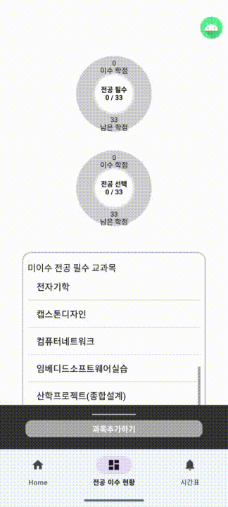
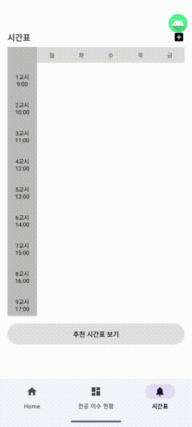

# SLICE(Schedule & Learning in ICE)

## 📄 프로젝트 소개
2025학년도 졸업작품으로, 시간표 및 전공 이수 내역 관리 모바일 애플리케이션 제작 프로젝트입니다.

## 📌 기획 의도
- 학번별로 상이한 졸업요건 때문에 발생하는 혼란/누락을 해소  
- PC 포털 위주 시스템의 모바일 접근성·UX 한계 보완  
- 이수 현황을 한눈에 보고, 목표 학점에 맞는 실용적 시간표 수립을 돕기 위함

## 🔨 기술 스택
- **App (Android)**: Kotlin / Android Studio  
- **Server (API)**: Spring Boot (Java)  
- **DB**: MySQL  
- **IDE & Tools**: IntelliJ, Android Studio  
- **기능 보조**: GPT API(추천 시간표 생성 프롬프트 → 결과 가공)

## 📝 동작 흐름

1. **인증**: 회원가입(이메일 인증, 비밀번호, 입학 연도) → 로그인  
2. **홈/과목 탐색**: 학년·트랙·전공필수 등 **필터링**으로 과목 리스트 확인  
3. **이수 관리**:  
   - 원형 그래프/리스트로 **이수·미이수 현황 시각화**  
   - **엑셀 업로드** 또는 **직접 입력**으로 이수 내역 반영/수정  
4. **시간표 구성**:  
   - 직접 과목/개인 일정(알바·스터디 등) 추가  
   - **추천 시간표 만들기**: 학년·목표 학점 입력 → (이수 내역·기존 일정 기반) 프롬프트 생성 → GPT 결과 2안 제시 → 선택 적용

## 📱 실행 화면
<h4>[메인 화면]</h2>

<h4>[이수 과목 업로드]</h2>

<h4>[시간표 추천]</h2>

## 👥 역할 분담
| 담당   | 역할/책임                         |
|--------|-----------------------------------|
| 노을   | 서버 API 개발, DB 설계·운영       |
| 조예리 | 모바일 앱 개발(UX/UI 포함)        |

